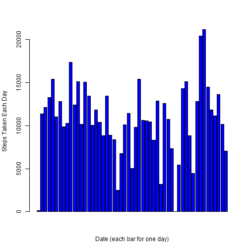
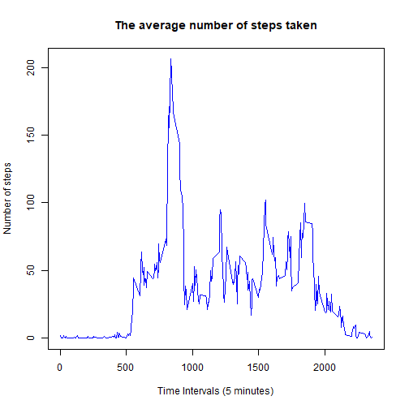
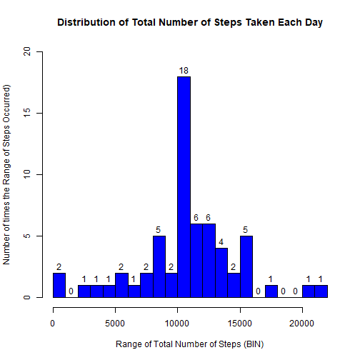
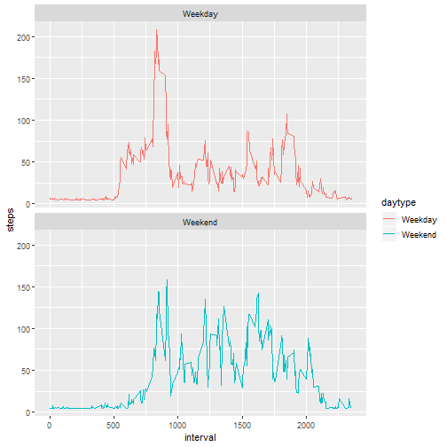

 

Loading and preprocessing the data
Show any code that is needed to

Load the data (i.e. read.csv())
Process/transform the data (if necessary) into a format suitable for your analysis


```r
library(markdown)
```

```
## Warning: package 'markdown' was built under R version 3.4.4
```

```r
library(knitr)
library(ggplot2)
```

```
## Warning: package 'ggplot2' was built under R version 3.4.4
```

```
## 
## Attaching package: 'ggplot2'
```

```
## The following object is masked _by_ '.GlobalEnv':
## 
##     diamonds
```

```r
library(dplyr)
```

```
## Warning: package 'dplyr' was built under R version 3.4.4
```

```
## 
## Attaching package: 'dplyr'
```

```
## The following objects are masked from 'package:stats':
## 
##     filter, lag
```

```
## The following objects are masked from 'package:base':
## 
##     intersect, setdiff, setequal, union
```

```r
setwd("C:/Training/Data Science/Course 5 Reproducible Research/Week 2/Project")
act <- read.csv("activity.csv", header=TRUE, sep=",")
head(act)
```

```
##   steps       date interval
## 1    NA 2012-10-01        0
## 2    NA 2012-10-01        5
## 3    NA 2012-10-01       10
## 4    NA 2012-10-01       15
## 5    NA 2012-10-01       20
## 6    NA 2012-10-01       25
```
What is mean total number of steps taken per day?
=================================================

For this part of the assignment, you can ignore the missing values in the dataset.

1 Calculate the total number of steps taken per day

Aggregate the steps by date


```r
NumOfStepsEachDays <- aggregate (steps ~ date, act, sum, na.rm=TRUE)
head(NumOfStepsEachDays)
```

```
##         date steps
## 1 2012-10-02   126
## 2 2012-10-03 11352
## 3 2012-10-04 12116
## 4 2012-10-05 13294
## 5 2012-10-06 15420
## 6 2012-10-07 11015
```

2 If you do not understand the difference between a histogram and a barplot, research the difference between them. Make a histogram of the total number of steps taken each day

Create a histogram plot using the steps with the number of bins = 25, adding the steps number at the bin top. Each bin represents a range of steps, i.e., range of 10000 to 11000 steps. The number in this bin is the number of times occurred.


```r
hist(NumOfStepsEachDays$steps, col="green", breaks=25, labels=TRUE,
     xlab="Range of Total Number of Steps (BIN)", ylab="Number of times the Range of Steps Occurred)", ylim=c(0, 20), 
     main="Distribution of Total Number of Steps Taken Each Day")
```


```r
#
# try barplot. this is just for demonstration purpose
#
barplot(NumOfStepsEachDays$steps, xlab="Date (each bar for one day)", ylab="Steps Taken Each Day", col = "Blue")
```




Observations:
-------------
The most common range of steps is between 10000 and 11000 steps, which occurred 10 times.


3 Calculate and report the mean and median of the total number of steps taken per day. 

Calculate using R mean and median functions


```r
MeanTotalNumOfStepsPerDay <- mean(NumOfStepsEachDays$steps, na.rm=TRUE)
MeanTotalNumOfStepsPerDay
```

```
## [1] 10766.19
```

```r
MedianTotalNumOfStepsPerDay <- median(NumOfStepsEachDays$steps, na.rm=TRUE)
MedianTotalNumOfStepsPerDay
```

```
## [1] 10765
```

What is the average daily activity pattern?
===========================================

Make a time series plot (i.e. type="l") of the 5-minute interval (x-axis) and the average number of steps taken, averaged across all days (y-axis)


```r
StepsByInterval <- aggregate (steps ~ interval, act, mean, na.rm=TRUE)

plot(StepsByInterval$interval, StepsByInterval$steps, pch = 20, xlab = "Time Intervals (5 minutes)", ylab = "Number of steps", type="l", col="blue", main = "The average number of steps taken")
```




Observations:
-------------
The daily activity pattern is: there are small number of steps before 7:00AM, then the steps increases to the maximum of about 200 between 8:00-9:00AM, the steps come down during the day to about 60, the steps come down again after work and reduce to zero.

Which 5-minute interval, on average across all the days in the dataset, contains the maximum number of steps?


```r
RowNum <- which.max(StepsByInterval$steps)
MaxInterval <- StepsByInterval[RowNum,1]
# the 5-minute interval below contains the max number of steps
MaxInterval
```

```
## [1] 835
```

```r
MaxMeanSteps <- StepsByInterval[RowNum,2]

# the 5-minute interval below contains the max number of steps which is
MaxMeanSteps
```

```
## [1] 206.1698
```

Observations:
------------
The maximum of steps of 206 occurred at the interval 835


Imputing missing values
=======================

Note that there are a number of days/intervals where there are missing values (coded as NA). The presence of missing days may introduce bias into some calculations or summaries of the data.

1 Calculate and report the total number of missing values in the dataset (i.e. the total number of rows with NAs). 


```r
# Find the NA steps (TRUE), the rest is FALSE
NAsVector <- is.na(act$steps)
# Find the total number of Missing Steps 
NumOfMissingValues <- sum(NAsVector)
NumOfMissingValues
```

```
## [1] 2304
```


2 Devise a strategy for filling in all of the missing values in the dataset. The strategy does not need to be sophisticated. For example, you could use the mean/median for that day, or the mean for that 5-minute interval, etc.


```r
head(act$steps[NAsVector])
```

```
## [1] NA NA NA NA NA NA
```

```r
# for simplicity, use the mean steps across all days

act$steps[NAsVector] <- mean(act$steps, na.rm=TRUE)

head(act$steps[NAsVector])
```

```
## [1] 37.3826 37.3826 37.3826 37.3826 37.3826 37.3826
```

```r
CheckNAs <- is.na(act$steps)
sum(CheckNAs)
```

```
## [1] 0
```

3 Create a new dataset that is equal to the original dataset but with the missing data filled in.

```r
newact <- act
```

4 Make a histogram of the total number of steps taken each day and Calculate and report the mean and median total number of steps taken per day. Do these values differ from the estimates from the first part of the assignment? What is the impact of imputing missing data on the estimates of the total daily number of steps?

```r
NewNumOfStepsEachDays <- aggregate (steps ~ date, newact, sum, na.rm=TRUE)
head(NewNumOfStepsEachDays)
```

```
##         date    steps
## 1 2012-10-01 10766.19
## 2 2012-10-02   126.00
## 3 2012-10-03 11352.00
## 4 2012-10-04 12116.00
## 5 2012-10-05 13294.00
## 6 2012-10-06 15420.00
```

```r
hist(NewNumOfStepsEachDays$steps, col="blue", breaks=25, labels=TRUE,
     xlab="Range of Total Number of Steps (BIN)", ylab="Number of times the Range of Steps Occurred)", ylim=c(0, 20), 
     main="Distribution of Total Number of Steps Taken Each Day")
```



```r
NewMeanTotalNumOfStepsPerDay <- mean(NewNumOfStepsEachDays$steps, na.rm=TRUE)
NewMeanTotalNumOfStepsPerDay
```

```
## [1] 10766.19
```

```r
#sprintf("MEAN of steps taken each day = %.3f", MeanTotalNumOfStepsPerDay)
NewMedianTotalNumOfStepsPerDay <- median(NewNumOfStepsEachDays$steps, na.rm=TRUE)
NewMedianTotalNumOfStepsPerDay
```

```
## [1] 10766.19
```
Observations:
------------
The general patterns between the original data set with missing steps (orignal data) and the new data set with missiing steps (new data) filled are very similar, however there is one difference in the steps range of 10000-11000 where the new data has a frequency of 18 while the orignal data has 10. The reason is that the missing steps is filled with average of 37.3826, and the 288 intervals has a total steps of 288*37.3826 = 10766 steps which is between 10000 and 11000.


Are there differences in activity patterns between weekdays and weekends?
=========================================================================

For this part the weekdays() function may be of some help here. Use the dataset with the filled-in missing values for this part.

1 Create a new factor variable in the dataset with two levels - "weekday" and "weekend" indicating whether a given date is a weekday or weekend day.

```r
newact <- mutate(newact, daytype = ifelse(weekdays(as.Date(newact$date))=="Saturday" | weekdays(as.Date(newact$date))=="Sunday", "Weekend", "Weekday"))
```

```
## Warning: package 'bindrcpp' was built under R version 3.4.4
```

```r
head(newact)
```

```
##     steps       date interval daytype
## 1 37.3826 2012-10-01        0 Weekday
## 2 37.3826 2012-10-01        5 Weekday
## 3 37.3826 2012-10-01       10 Weekday
## 4 37.3826 2012-10-01       15 Weekday
## 5 37.3826 2012-10-01       20 Weekday
## 6 37.3826 2012-10-01       25 Weekday
```
2 Make a panel plot containing a time series plot (i.e. type="l") of the 5-minute interval (x-axis) and the average number of steps taken, averaged across all weekday days or weekend days (y-axis). See the README file in the GitHub repository to see an example of what this plot should look like using simulated data.


```r
StepsByInterval <- aggregate (steps ~ interval + daytype, newact, mean, na.rm=TRUE)

ggplot(StepsByInterval, aes(x =interval , y=steps, color=daytype)) +
#  geom_line() + facet_wrap(~ daytype, ncol = 2, nrow=1)
  geom_line() + facet_wrap(~ daytype, ncol = 1, nrow=2)
```



```r
StepsByInterval[StepsByInterval$steps==max(StepsByInterval$steps) & StepsByInterval$daytype == 'Weekday',]
```

```
##     interval daytype    steps
## 104      835 Weekday 207.8732
```

```r
weekdays <- filter(StepsByInterval, daytype=="Weekday")
maxstepWeekDays <- weekdays[weekdays$steps==max(weekdays$steps),]

weekends <- filter(StepsByInterval, daytype=="Weekend")
maxstepWeekends <- weekends[weekends$steps==max(weekends$steps),]
```
The maximum steps during weekdays is 208 at the interval 835 and the maximum steps during weekends is 158 at the interval 915


Observations:
-------------
From the steps pattern, it can be seen that this person walk most of the steps during the morning between 8 and 9 AM, while he/she walks more steps on averge during the weekend than the weekday.


```r
library(knitr)
#knit("Course5Week2Project.Rmd")
```

The end of the assignment


